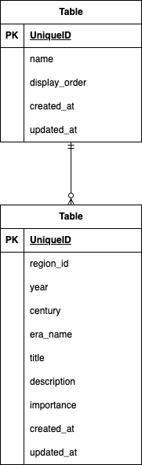

# 歴史年表アプリ　PARALLEL

## 概要

歴史学習用Webアプリケーションです。時代別、もしくは地域別の史実を調べられる、シンプルなアプリです。学校の試験勉強などを想定して作成しました。

## 画面サンプル

①　トップ画面->世紀で検索

<video src="https://github.com/user-attachments/assets/d58d9560-f640-4910-b3ff-88052dae8dc7" loop muted autoplay playsinline width="100%"></video>

②　トップ画面->地域別検索画面

<video src="https://github.com/user-attachments/assets/d3ec0443-11ae-4323-9dc5-f62baeea2efc" loop muted autoplay playsinline width="100%"></video>

**特徴**

- 時代別検索: 図書館で利用される日本十進分類法（NDC）を参考に、0〜9類の分類に基づいて記事を分類しています。
- 地域別検索: 1つの記事に対して最大10個の見出しと本文を自由に構成できます。

## 前提条件

- **Docker / Docker Desktop**: 20.x 以上
- **Node.js**: 20.x 以上
- **Git**

## 使用技術

### バックエンド

- **PHP**: 8.3
- **Laravel**: 13.x (Sail)
- **MySQL**: 8.0
- **phpMyAdmin**: (Docker環境)

### フロントエンド

- **Next.js**: 16.x (App Router)
- **TypeScript**: 5.x
- **Tailwind CSS**: v4.0 (最新のPostCSS連携)

## 環境構築

1.  リポジトリのクローン

```bash
git clone <repository_url>
cd history-parallel
```

2.  バックエンド (Laravel Sail) のセットアップ

```bash
cd backend
cp .env.example .env

# パッケージのインストール（Docker経由）
docker run --rm \
    -u "$(id -u):$(id -g)" \
    -v "$(pwd):/var/www/html" \
    -w /var/www/html \
    laravelsail/php83-composer:latest \
    composer install --ignore-platform-reqs

# Sailの起動
./vendor/bin/sail up -d

# 初期設定（マイグレーション・初期データ投入）
./vendor/bin/sail artisan key:generate
./vendor/bin/sail artisan migrate:fresh --seed
```

3.  フロントエンド (Next.js) のセットアップ

```bash
cd ../frontend
npm install
npm run dev
```

## URL

- **サイトTOP**: http://localhost:3000
- **phpMyAdmin**: http://localhost:8080

## テーブル仕様

### regions テーブル

地域区分を管理します。

| カラム名      | 型      | 説明                               |
| :------------ | :------ | :--------------------------------- |
| id            | BigInt  | プライマリキー                     |
| name          | String  | 地域名（日本、中国・朝鮮半島など） |
| display_order | Integer | 表示順序（1〜6）                   |

### historical_events テーブル

個別の史実データを管理します。

| カラム名    | 型        | 説明                                                 |
| :---------- | :-------- | :--------------------------------------------------- |
| id          | BigInt    | プライマリキー                                       |
| region_id   | ForeignId | `regions.id` への外部キー                            |
| year        | Integer   | 西暦（紀元前はマイナス数値で保持。例：-500 = BC500） |
| century     | Integer   | 所属する世紀（検索インデックス用）                   |
| era_name    | String    | 和暦・元号（例：江戸時代、明治元年など）             |
| title       | String    | 出来事の名称                                         |
| description | Text      | 出来事の詳細説明                                     |
| importance  | TinyInt   | 重要度（1:標準, 2:重要, 3:最重要）                   |

---

## ER 図


